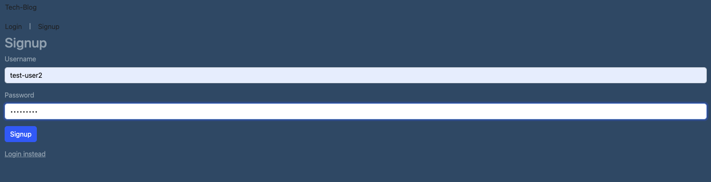
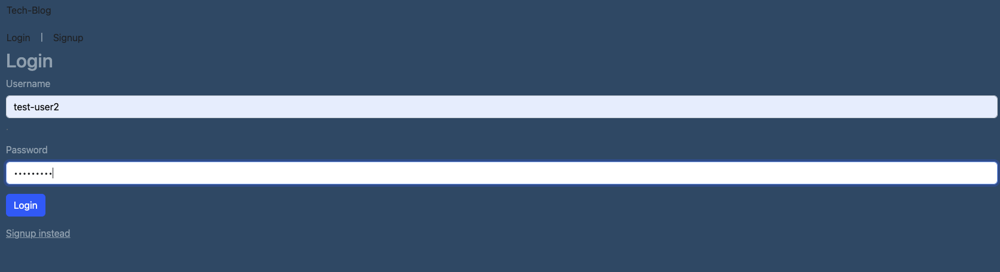
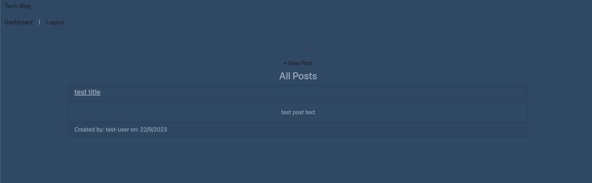
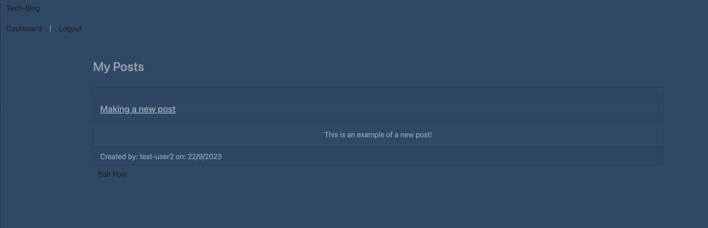
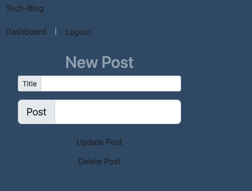
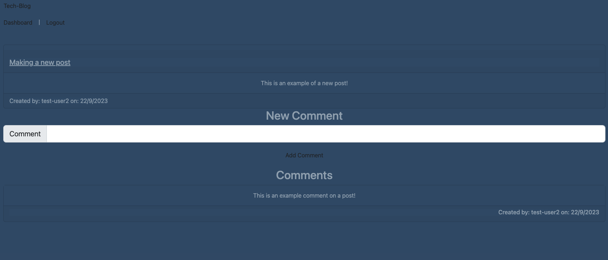

# tech-blog

## Description

A CMS-style blog web application.

## Table of Contents

-[Installation](#installation)

-[Usage](#usage)

-[Credits](#credits)

-[Tests](#tests)

-[License](#license)

-[Questions](#questions)

## Installation

N/A

## Usage

In order to use this web application you will first need to create an account by clicking the signup button.

If you already have an account you can click login and enter your information there instead.

When you are logged in you can see both the homepage:  and the dashboard which shows all your posts and allows you to edit or delete them. 

Now that you are logged into the site you can make new posts by clicking the new post button on the homepage.

or edit/delete one of your existing posts.

You are also able to comment on posts by clicking the post and entering a comment in the text box and the clicking add comment! 

## Credits

This project makes use of node and express for the backend while utilizing sequelize and mysql for the database. It also uses bcrypt to safely store user information.

## Tests

N/A

## License

This project is licensed under the MIT license.

## Questions

If you have any questions, please contact me at chasegarrett@tutanota.com. You can also visit my [GitHub](https://github.com/Chase-Garrett) for more of my work.
